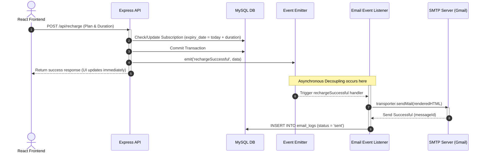

# Recharge & Notification System ⚡
### Full-Stack Internship Showcase Guide (React, Express, MySQL, Nodemailer, EventEmitter, Cron)

Welcome! This document is designed to help you run, understand, and explain the architecture of this system for your upcoming internship interview. It covers how the codebase works, the design patterns used, and tips on how to impress your interviewer on Monday.

---

## 🚀 Monday Morning Checklist: How to Start and Demo the Project

Follow these steps to spin up the project and demo it live:

### 1. Start your Database
- Open XAMPP / WampServer and start the **MySQL** service (verify it is listening on port `3306`).

### 2. Launch the Backend Server
1. Open a terminal, navigate to the `backend` folder, and start the server:
   ```bash
   cd backend
   npm start
   ```
2. **What to verify:** Look at the logs. It should output:
   - `🔌 Connecting to MySQL server...`
   - `✅ Database "recharge_notification_system" verified/created successfully.`
   - `✅ All database tables verified/created successfully.`
   - `📬 Configured SMTP credentials found. Initializing SMTP mailer...`
   - `📡 Backend Server listening on http://localhost:5000`

### 3. Launch the Frontend React Client
1. Open a second terminal, stay in the root folder, and start the Vite dev server:
   ```bash
   npm run dev
   ```
2. Open your browser to **`http://localhost:5173/`**.

### 4. Interactive Live Demo Steps
1. **Google Login:** Click the **Sign In with Google** button. Grant permission. This registers your email (`yashpatil3638@gmail.com`) automatically in the database with a `NULL` password.
2. **Make a Recharge:** Select a plan (e.g., *Premium*) and a duration, then click **Simulate Payment**. 
   - Observe the 2-second loading spinner (simulates a payment gateway).
   - Once completed, look at your actual phone/inbox. You will receive a stylized confirmation email sent from the backend!
3. **Inspect the logs:** Go to your **Notifications** tab in the UI to see the logged transaction, or check the database.
4. **Trigger Cron Jobs:** Log out, register a new account and check the **"Register as Admin User"** checkbox. Log in as an Admin, click the **Admin Panel**, and click **Simulate Expiring Check**. This simulates the daily cron job executing bulk processing.

---

## 🏗️ System Architecture & Data Flow



---

## 🔑 Explaining the Logic (For Your Interview)

Be ready to explain the three pillars of this project: **Database Schema**, **Event-Driven Architecture**, and **Bulk Processing Loops**.

### 1. Database Schema
We use a clean relational schema inside MySQL with three main tables:
* **`users`**: Stores client identity details. `password` is nullable to allow standard register/login side-by-side with **Google OAuth (using Google Identity Services)**.
* **`subscriptions`**: Tracks the active product, timeline (`start_date`, `expiry_date`), and state (`active` vs `expired`). It references `users.id` via a foreign key with `ON DELETE CASCADE`.
* **`email_logs`**: Serves as a system audit log of every email dispatched, recording the recipient, subject line, timestamp, and status (`sent` or `failed`).

---

### 2. Event-Driven Architecture (Using Node's `EventEmitter`)
**What it is:** Instead of executing email-sending code directly inside the API controllers, the API controllers simply emit a notification event (e.g. `rechargeSuccessful`) and complete the HTTP request immediately. A separate listener catches the event and sends the email in the background.

#### 📂 Code Reference:
- **Shared Emitter:** Built in [eventEmitter.js](file:///c:/Users/Yash%20Patil/OneDrive/PROJECTS/Recharge%20Notification%20System/backend/utils/eventEmitter.js)
- **Subscribing to Events:** Built in [emailListener.js](file:///c:/Users/Yash%20Patil/OneDrive/PROJECTS/Recharge%20Notification%20System/backend/listeners/emailListener.js)
- **Emitting Events:** Triggered on recharge inside [api.js](file:///c:/Users/Yash%20Patil/OneDrive/PROJECTS/Recharge%20Notification%20System/backend/routes/api.js#L210) or on cron checks inside [cronJobs.js](file:///c:/Users/Yash%20Patil/OneDrive/PROJECTS/Recharge%20Notification%20System/backend/cron/cronJobs.js).

#### 💡 Interview Tip: Why do this? (High-Value Answer)
> *"By using Node's `EventEmitter`, we decouple the core API request-response cycle from slow, IO-heavy tasks like email sending. If a mail server is slow or goes offline, the customer's recharge transaction still completes instantly in under 50ms, and the email fails or retries in the background without locking the user interface."*

---

### 3. Bulk Processing & Expiry Loops (Workflow 2 & 3)
We run a scheduler inside [cronJobs.js](file:///c:/Users/Yash%20Patil/OneDrive/PROJECTS/Recharge%20Notification%20System/backend/cron/cronJobs.js) using `node-cron` configured to trigger daily. Here is how the loop logic works for **bulk processing**:

```javascript
// 1. Fetch expiring users
const query = `
  SELECT s.*, u.name, u.email 
  FROM subscriptions s 
  JOIN users u ON s.user_id = u.id 
  WHERE s.expiry_date <= CURDATE() + INTERVAL 3 DAY 
    AND s.expiry_date >= CURDATE()
    AND s.status = 'active'
`;
const [subscriptions] = await connection.query(query);

// 2. Loop through results and process asynchronously
for (const sub of subscriptions) {
  // Check email logs to avoid sending duplicate warnings in the same subscription period
  const [[logCount]] = await connection.query(checkLogQuery, [sub.user_id, sub.start_date]);
  
  if (logCount.count === 0) {
    // 3. Emit the event for each expiring subscription
    eventEmitter.emit('subscriptionExpiring', {
      userId: sub.user_id,
      name: sub.name,
      email: sub.email,
      planName: sub.plan_name,
      expiryDate: sub.expiry_date
    });
  }
}
```

#### 💡 How the loop executes:
1. **Query:** MySQL filters subscriptions where the expiry date is within the 3-day window.
2. **Loop:** The `for...of` loop processes each matching subscription one-by-one.
3. **Event Dispatch:** For each record, the cron runner emits the `subscriptionExpiring` event.
4. **Listener Execution:** The listener catches the event, connects to Gmail SMTP using Nodemailer, sends the email, and inserts a log into `email_logs`.
5. **Next Iteration:** The loop continues until all matches are processed.

---

## 💬 Tough Interview Questions & How to Answer Them

#### Q: How does this system scale if you have 100,000 subscriptions expiring at once?
**Answer:** 
> *"Right now, `EventEmitter` runs in-memory and works well for small to medium apps. However, for 100,000 users, running an in-memory loop would block Node's single-threaded event loop and exceed SMTP rate limits. In production, I would upgrade this by using a distributed queue like **BullMQ with Redis** or **RabbitMQ**. This would allow us to distribute the email-sending load across multiple background workers, implement rate limiting (throttling), and automatically retry failed emails."*

#### Q: Why did you use connection pooling for MySQL instead of single connections?
**Answer:**
> *"Creating a new TCP connection to a database for every single HTTP request is expensive and slows down performance. Connection pooling maintains a set of warm, open connections that are recycled. When a request comes in, it grabs an idle connection from the pool instantly, uses it, and releases it back to the pool, improving speed and preventing the database from running out of file descriptors under high traffic."*

#### Q: How do you verify that the Google OAuth ID Token sent from the frontend is secure?
**Answer:**
> *"We do not trust user data from the client-side. The frontend sends the Google credential JWT to our backend `POST /api/auth/google` route. On the server, we use Google's official `google-auth-library` to parse and verify the cryptographic signature against Google's public keys. This ensures the token was actually issued by Google and has not been tampered with before we log the user in."*
